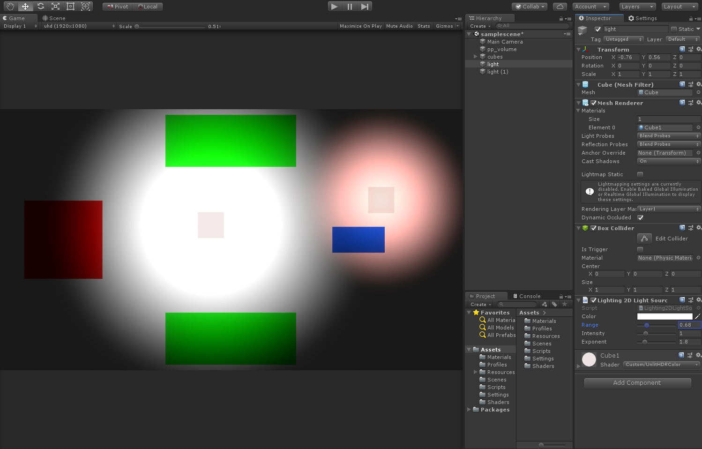

# Screen Space 2D Lighting
This is a simple lighting system implemented using the newest Unity 2018.3 (still in beta when this document was written), 
built on top of the new Post-Processing Stack, using the LightWeight Render Pipeline. 
By using LWRP, this system provides a high performance 2D lighting in low-end devices.
Even thought the target is performance constrained platforms, the system works on standard render pipelines as well.

Video Demo Here: https://youtu.be/utWp8z9cATo

# Features
* Multiple light sources
* Ambient Light
* Build on top of the new LWRP

# How it works
* Post-Process Stack Extension: If you use the newest LightWeight Render Pipeline, you're not able to use post-processing shaders the old way (with OnRenderImage). 
The way to go now is "extending" the stack post processing. Basicaly you have to inherit from the "PostProcessEffectRenderer" class and override the "Render" method.
This part is implemented in the class "Lighting2D.cs".

* The Method: The light system is fairly simple. For each light source object in the scene, a circle gradient is drawn in a render texture. 
This render texture is then used in a post-processinng hlsl shader (the new post-processing stack uses hlsl instead of cg) to add the lights to the scene.
